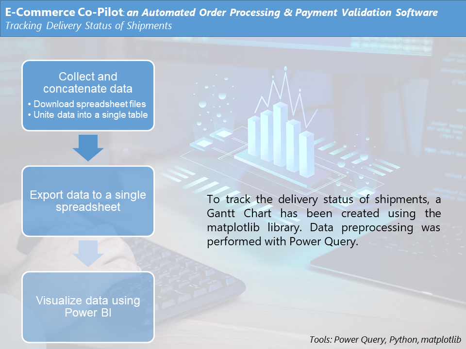

#  **E-Commerce Co-Pilot** 

***E-Commerce Co-Pilot*** is a comprehensive software solution designed to  enhance online business operations, covering all aspects from order  processing and delivery to financial reconciliation. Its advanced  features streamline and automate the e-commerce process, simplifying  complex tasks and improving efficiency. 

> Tools utilized in this project
>
> 

### *Overview*

### *Order Processing*

### *Monitoring Payments*

### *Tracking Delivery Status*

## Results

#### Monitoring remitted payments 

#### Tracking the delivery status

