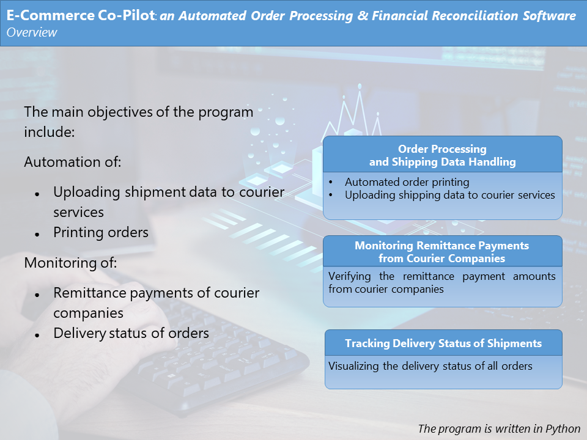

> ### [Dashboard - Trading Analysis of Shipments](https://github.com/michailprev/Data-Analysis/blob/main/Retail%20Shipping/Dashboard%20-%20Trading%20Analysis%20of%20Shipments.png)

> ### [Dashboard - Shipments Status](https://github.com/michailprev/Data-Analysis/blob/main/Retail%20Shipping/Dashboard%20-%20Shipments%20Status.png)

#### About the dataset

The dataset contains information of retail shipping from two courier companies. The main objectives of the these dashboards encompass two key aspects :

- Tracking the delivery times of each shipment, visualized effectively through a Gantt Chart

- Monitoring remitted payments, including remittance dates and corresponding sales amounts, to enhance financial oversight and performance analysis of the courier services

# Description of Software

